# Guía de Presentación — Análisis de Canasta de Mercado

> **Objetivo:** Encontrar patrones de compra en 100 clientes usando Apriori y ECLAT, para mejorar ventas cruzadas y segmentar clientes.

---

## 1. ¿Qué productos se compran más?

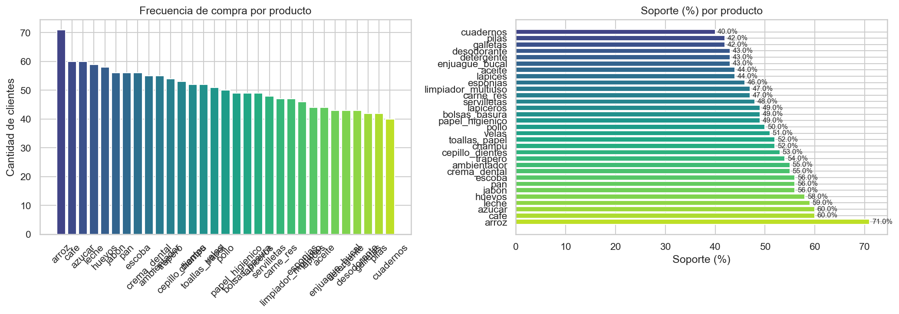

**Qué decir:** "La barra izquierda muestra cuántos clientes compraron cada producto. La derecha muestra el soporte (%). **Arroz, café y azúcar** son los más comprados — son el núcleo del negocio. Cualquier promoción que incluya estos productos tendrá mayor alcance."

---

## 2. ¿Quiénes son los clientes?

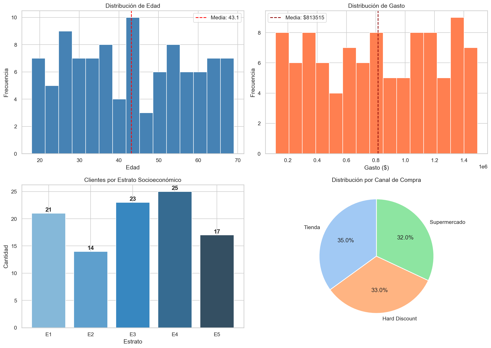

**Qué decir:** "Vemos la distribución de edad, gasto, estrato y canal de compra. La línea roja en los histogramas es el promedio. El gráfico de torta muestra por dónde compran — esto define si las estrategias deben ser digitales o presenciales."

---

## 3. ¿Qué productos se compran juntos?

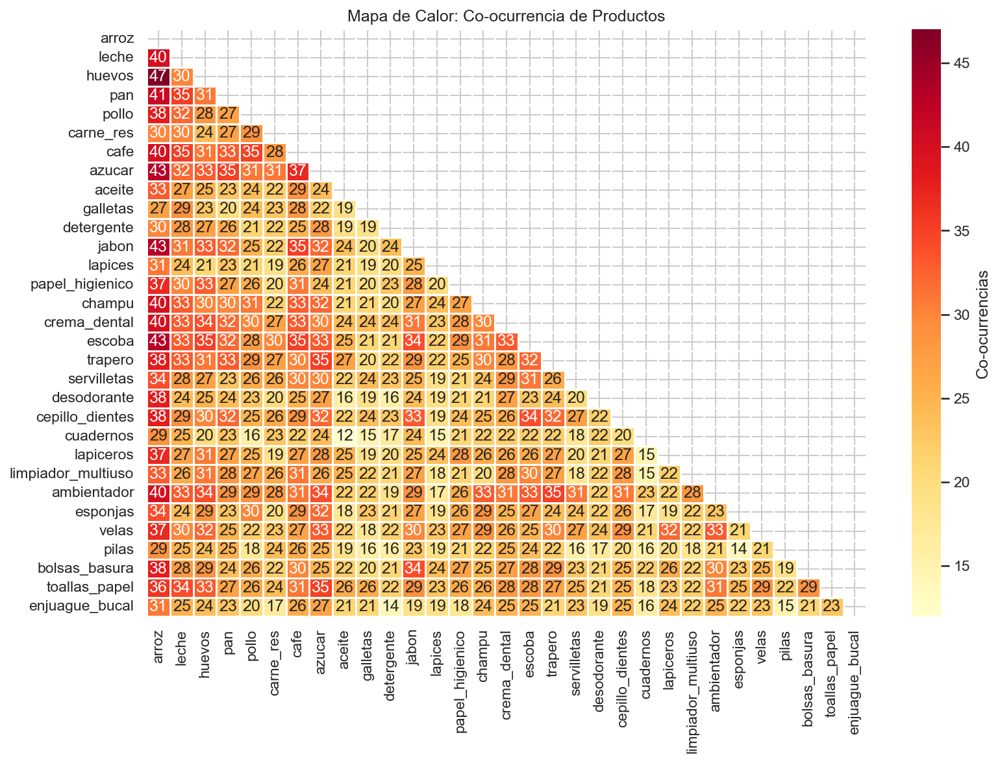

**Qué decir:** "Las celdas más oscuras son pares de productos que se compran juntos con más frecuencia. Este mapa es una vista rápida de las asociaciones antes de aplicar los algoritmos. Los bloques de calor concentrados forman 'familias' de compra conjunta."

---

## 4. ¿Cuánto gastan según canal y estrato?

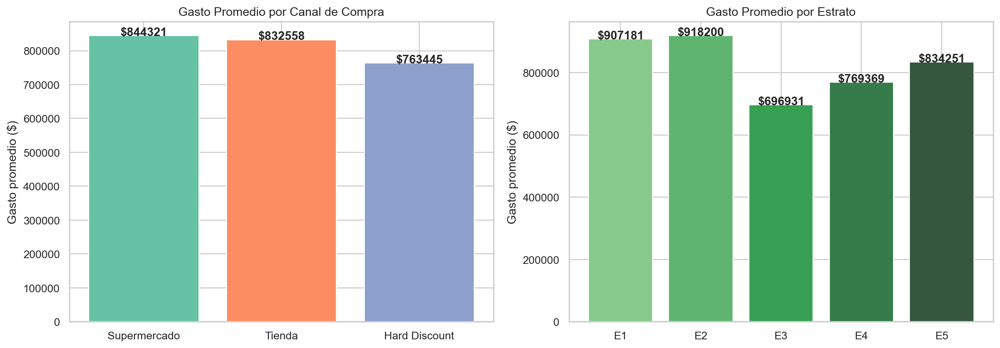

**Qué decir:** "El canal con barra más alta es el más rentable por cliente. En estrato, lo esperado: a mayor estrato, mayor gasto. Esto sirve para priorizar dónde invertir en marketing."

---

## 5. Algoritmo APRIORI — Reglas de Asociación

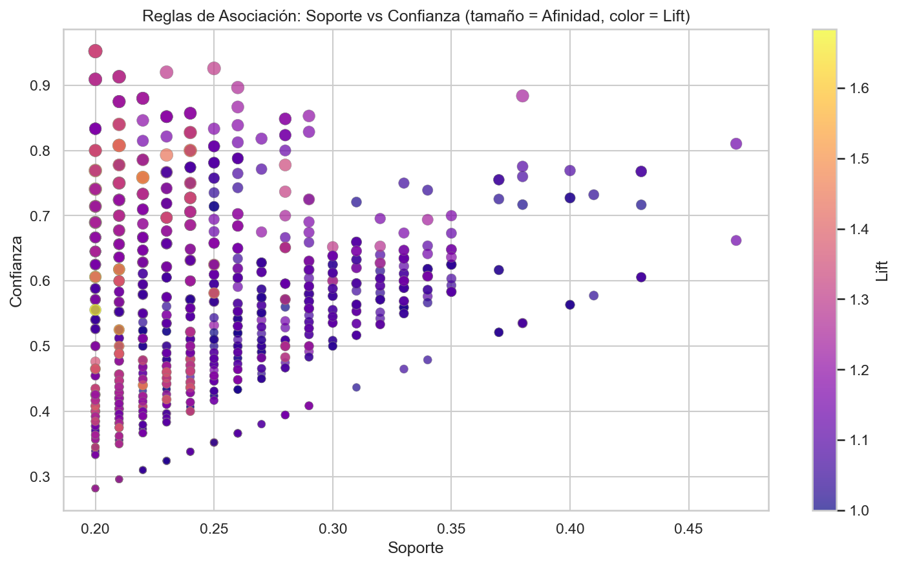

**Qué decir:** "Cada punto es una regla del tipo 'si compra A → compra B'. Las reglas en la esquina **superior derecha** son las mejores: alta frecuencia y alta confianza. El color amarillo/claro indica mayor lift (más lejos del azar). Ahí están las reglas accionables."

**Las 3 métricas:**
| Métrica | Qué significa | Valor bueno |
|---------|--------------|-------------|
| **Soporte** | Qué tan frecuente es la regla | > 20% |
| **Confianza** | % de veces que B ocurre dado A | > 50% |
| **Lift** | ¿Es mejor que el azar? | > 1.0 |

---

## 6. Top 15 mejores reglas

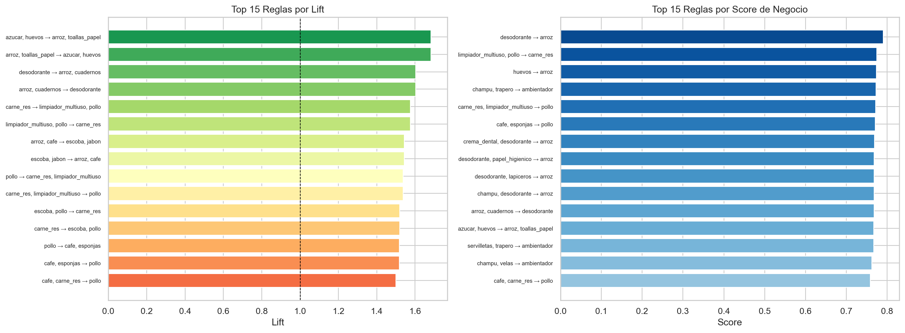

**Qué decir:** "Izquierda: las 15 reglas con mayor lift. La línea punteada es lift=1 (el azar). Todas están por encima, o sea que **no son coincidencia**. Derecha: las 15 mejores por Score de Negocio (combina soporte + confianza + lift). Estas son las reglas más accionables para el negocio."

---

## 7. ¿Qué tan fuerte es cada par A → B?

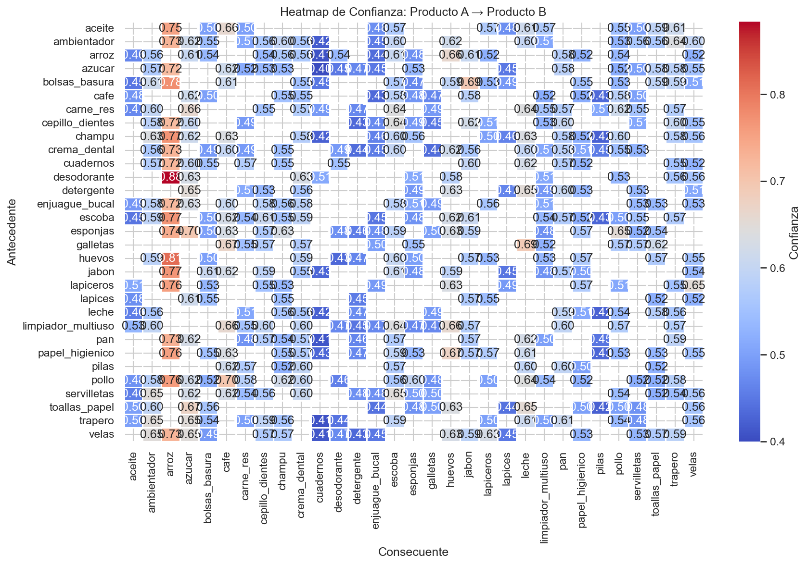

**Qué decir:** "Cada celda dice: 'de los que compraron el producto de la fila, X% también compró el de la columna'. Rojo intenso = relación muy fuerte. Se puede usar para **combos, promociones cruzadas o layout de tienda**."

---

## 8. Reglas por canal de compra

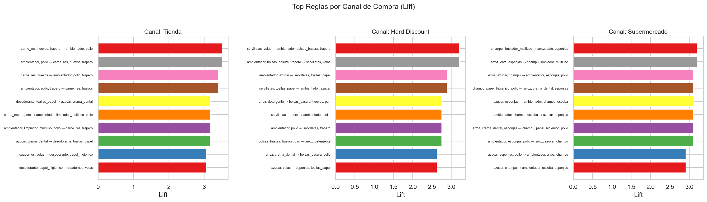

**Qué decir:** "Las asociaciones cambian según el canal. Un cliente online tiene patrones distintos al que va a la tienda. Esto permite hacer **recomendaciones personalizadas por canal**."

---

## 9. Algoritmo ECLAT — Itemsets frecuentes

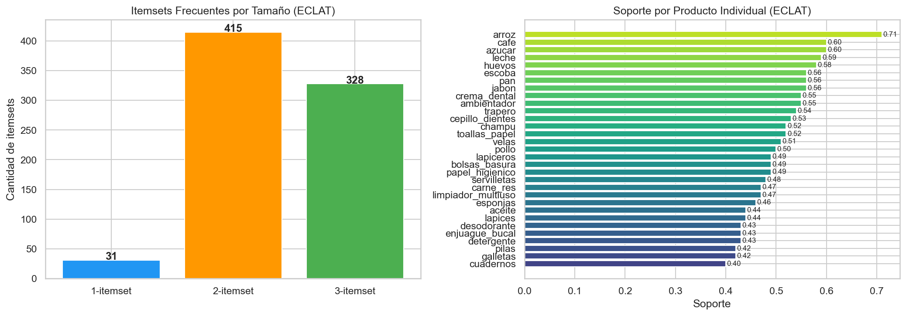

**Qué decir:** "ECLAT encuentra grupos de productos que se compran juntos sin necesitar dirección. Siempre hay más grupos de 1 producto que de 2, y más de 2 que de 3. La barra derecha confirma los mismos productos más comprados que vimos antes."

---

## 10. Top pares y tríos de productos

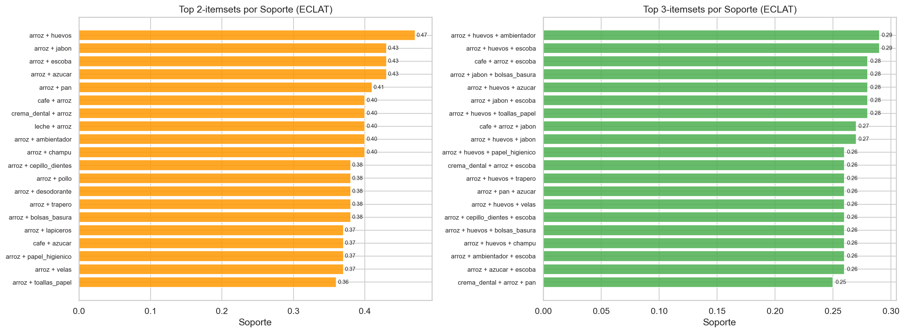

**Qué decir:** "Izquierda: los pares más frecuentes. Derecha: los tríos más frecuentes. Un trío con soporte 0.40 significa que 4 de cada 10 clientes compran esos 3 productos juntos — ideal para un **combo o promoción 3x2**."

---

## 11. Segmentación por Estrato — Heatmap

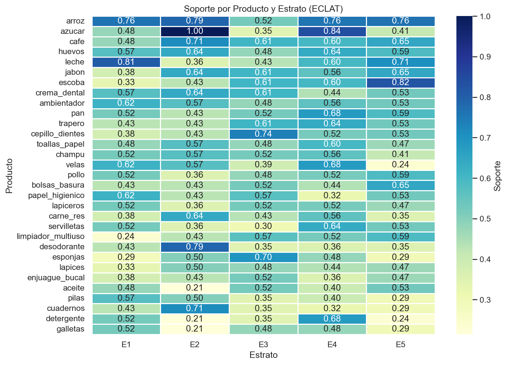

**Qué decir:** "Cada columna es un estrato, cada fila un producto. Los productos con diferencias grandes entre columnas son **sensibles al nivel socioeconómico**. Esto permite personalizar el catálogo por zona o segmento."

---

## 12. Radar por estrato

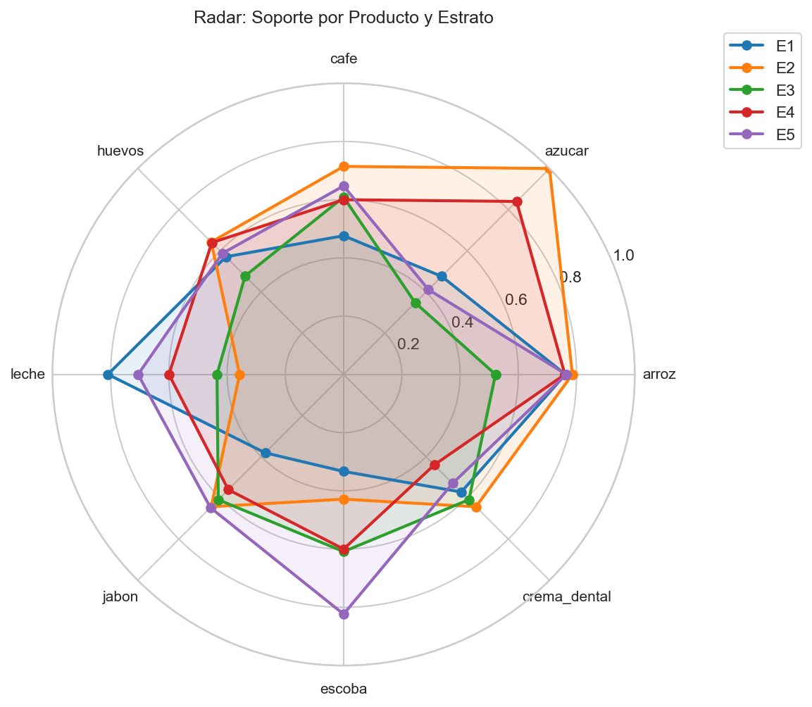

**Qué decir:** "Cada eje es un producto top. Cuando las líneas se separan, hay diferencia entre estratos para ese producto. El área del polígono representa la 'amplitud de consumo' de cada estrato — estratos con áreas más grandes son compradores más diversos."

---

## 13. Top 5 productos por estrato

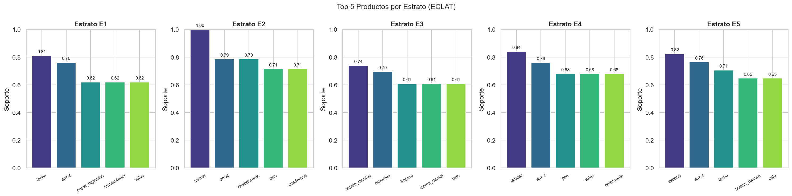

**Qué decir:** "Para cada estrato, estos son los productos más comprados. Acción directa: **adaptar el inventario y las ofertas** según el estrato predominante en cada sucursal o zona."

---

## 14. Segmentación por Edad

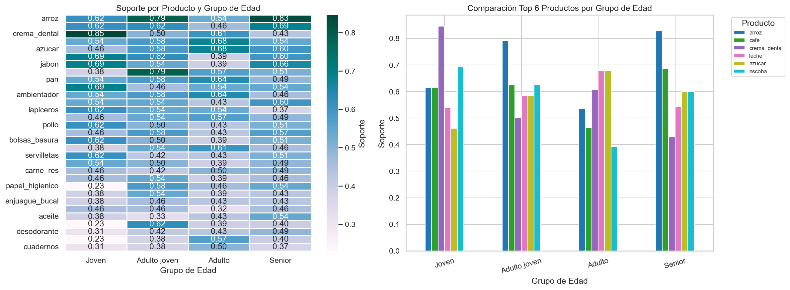

**Qué decir:** "Izquierda: soporte de cada producto por grupo de edad. Derecha: comparación del top 6. Por ejemplo, si `crema_dental` es alta en jóvenes y baja en seniors, hay una diferencia generacional clara que guía las campañas."

---

## 15. Clientes y gasto por edad

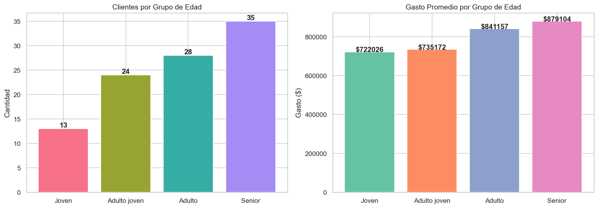

**Qué decir:** "Seniors son el grupo más numeroso (35) y también el que más gasta ($879K promedio). Los jóvenes son los menos y gastan menos. **Estrategia:** fidelizar seniors con programas de lealtad; captar más jóvenes con canales digitales."

---

## 16. Red de Asociaciones

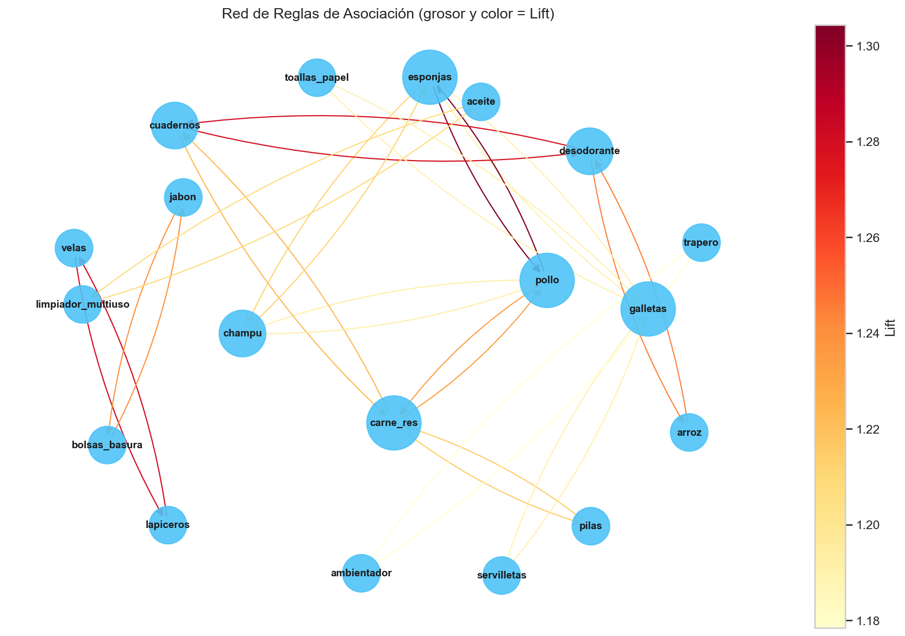

**Qué decir:** "Cada nodo es un producto, cada flecha es una regla. El grosor y color rojo/naranja de la flecha indica mayor lift. **Los nodos más grandes y conectados son los productos ancla** — ponerlos en puntos estratégicos de la tienda o usarlos como gancho en promociones genera más ventas cruzadas. `pollo`, `cuadernos` y `desodorante` son los más conectados."

---

## 17. Validación: Apriori vs ECLAT

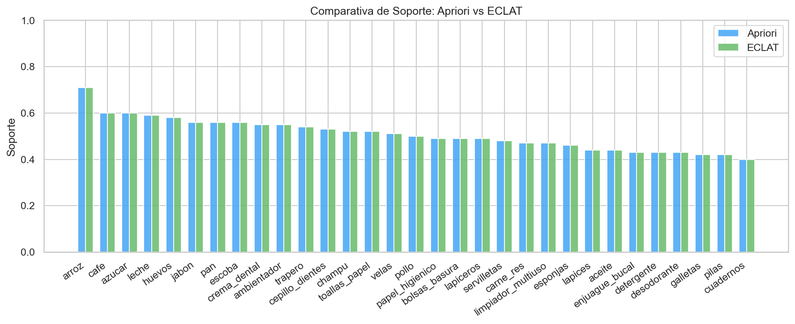

**Qué decir:** "Las barras azul (Apriori) y verde (ECLAT) son **idénticas** para todos los productos. Esto valida que ambos algoritmos son correctos y que los resultados son confiables. La diferencia entre ambos es siempre 0.0."

---

## CONCLUSIÓN (3 puntos clave)

1. **Operativo:** colocar juntos en tienda los productos con reglas más fuertes (`pollo`, `galletas`, `desodorante`, `cuadernos`)
2. **Segmentado:** seniors gastan más → fidelizarlos; estrato 2 tiene el soporte más alto en azúcar (100%) → no puede faltar stock
3. **Validado:** Apriori y ECLAT coinciden en todos los valores → los resultados son robustos

---

## Si te preguntan algo difícil

**¿Por qué el soporte mínimo es 20%?**
> Con 100 clientes, 20% = 20 personas. Es el mínimo para que una regla sea estadísticamente relevante sin perder demasiadas asociaciones.

**¿Lift de 1.3 es bueno?**
> Sí. Significa que la compra conjunta ocurre 30% más de lo esperado por azar. En supermercados con miles de productos, lift > 1.2 ya es significativo.

**¿Para qué sirve esto en la práctica?**
> Sistemas de recomendación, diseño del layout de tienda, combos promocionales, personalización por segmento y gestión de inventario conjunto.
